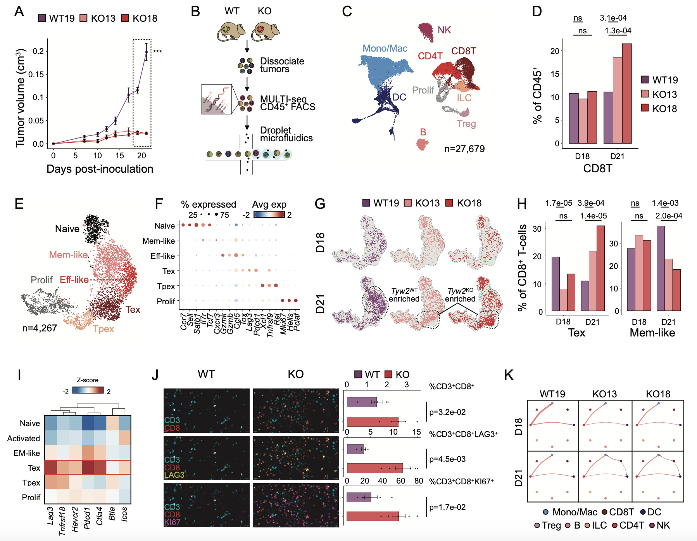

# tyw2_neoantigen
Companion code for Weller, Bartok, McGinnis, et al, 2024. "Translation dysregulation in cancer as a source for targetable antigens"

Full Seurat object (seu_ys_final.Robj) and merged cellchat object list (cc_obj_list.Robj) are available for download at synapse (https://www.synapse.org/Synapse:syn61841510)

Figure 6: Tumor growth curves, immune cell type UMAP, CD8T proportion timecourse barchart, CD8T subtype UMAP, CD8T subtype annotation dotplot, CD8T sample UMAPs, CD8T subtype proportion timepoint barchart, CD8T exhaustion marker z-score heatmap, CODEX analyses, and CellChat IFNG signaling network.

Figure S6: Immune cell type annotation dotplot, Immune cell type proportion timepoint barchart and p-value heatmap, CD8T subtype proportion timepoint barchart and p-value heatmap, NK subtype UMAP and annotation marker feature plots, and Cytotoxic NK cell subtype proporton and cytotoxicity score timepoint barchart and violin plot

